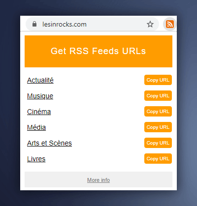

<a href="https://chrome.google.com/webstore/detail/get-rss-feed-url/kfghpdldaipanmkhfpdcjglncmilendn?hl=fr"></a

# What is Get RSS Feed URL Extension?

**get-rss-feed-url-extension is a Google Chrome extension that provides links to the various RSS/Atom feeds of a website.**

Indeed, websites do not always provide a direct link to the RSS feed. It is then necessary to look in the source code of the website and find the URL of the feed.

This extension makes it possible to avoid this manipulation because the URLs of the RSS feeds of the website are displayed directly!

# Install

Install this extension from [**Chrome Web Store**](https://chrome.google.com/webstore/detail/get-rss-feed-url/kfghpdldaipanmkhfpdcjglncmilendn?hl=fr).

# Feedback

If you encounter a problem using get-rss-feed-url-extension, or would like to request an enhancement, feel free to create an issue or say hello on [Twitter](https://twitter.com/shevabam)!

---

# Qu'est-ce que Get RSS Feed URL Extension ?

**get-rss-feed-url-extension est une extension Google Chrome qui permet d'obtenir les liens vers les différents flux RSS/Atom d'un site Internet.**

En effet, les sites Internet ne mettent pas toujours à disposition un lien direct vers le flux RSS. Il faut alors chercher dans le code source et trouver l'URL du flux.

Cette extension permet d'éviter cette manipulation car les URL des flux RSS du site Internet sont affichés directement !

# Installation

Installez l'extension à partir du [**Chrome Web Store**](https://chrome.google.com/webstore/detail/get-rss-feed-url/kfghpdldaipanmkhfpdcjglncmilendn?hl=fr).

# Feedback

Si vous rencontrez un problème avec l'extension, ou que vous souhaitez une évolution, n'hésitez pas à créer une *issue* ou à me contacter sur [Twitter](https://twitter.com/shevabam) !