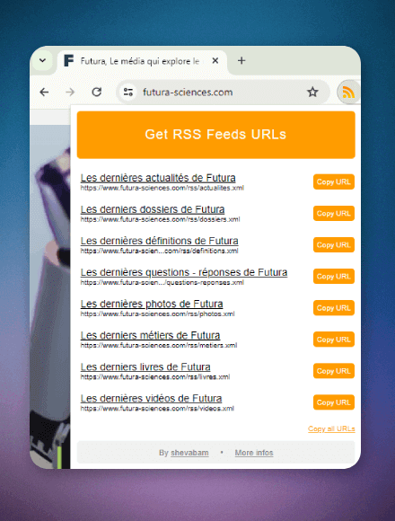
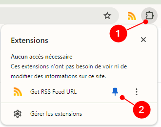
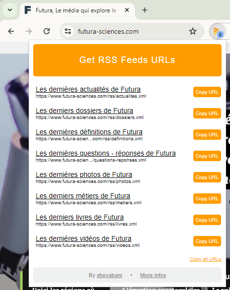

# What is Get RSS Feed URL Extension?

**Get RSS Feed URL is a Google Chrome extension that provides links to the various RSS/Atom feeds of a website.**

Indeed, websites do not always provide a direct link to the RSS feed. It is then necessary to look in the source code of the website and find the URL of the feed.

This extension makes it possible to avoid this manipulation because the URLs of the RSS feeds of the website are displayed directly and can be copied with one click!

In addition, this extension allows you to easily retrieve the RSS feed from a Youtube channel / user or from a subreddit!

# Install

Install this extension from [**Chrome Web Store**](https://chrome.google.com/webstore/detail/get-rss-feed-url/kfghpdldaipanmkhfpdcjglncmilendn) or [**Microsfot Edge Store**](https://microsoftedge.microsoft.com/addons/detail/get-rss-feed-url/pgbelohmepchkohpdldadopkblkgbjom).

# Usage

After installing the extension, display it in your browser:

Then go to a site and click on the extension button to display the different RSS feeds found:

You can also open this popup from the keyboard shortcut: `Alt+Shift+R`. You can [edit it in your Chrome settings](chrome://extensions/shortcuts) (Extensions > Keyboard shortcuts).

You can copy the URL of an RSS feed by clicking on the "Copy URL" button.
If you want to copy the URLs of all RSS feeds found, click "Copy all URLs".

# Feedback

If you encounter a problem using Get RSS Feed URL extension, or would like to request an enhancement, feel free to create an issue or say hello on [Twitter/X](https://twitter.com/shevabam)!

# Privacy Policy

The extension does not collect any user information or other information. Some data can be requested using the XHR API (only GET requests) in order to provide more context to retrieve a website's RSS feed.

The extension does not store any data on the browser or on the computer.

---

# Qu'est-ce que Get RSS Feed URL Extension ?

**Get RSS Feed URL est une extension Google Chrome qui permet d'obtenir les liens vers les différents flux RSS/Atom d'un site Internet.**

En effet, les sites Internet ne mettent pas toujours à disposition un lien direct vers le flux RSS. Il faut alors chercher dans le code source et trouver l'URL du flux.

Cette extension permet d'éviter cette manipulation car les URL des flux RSS du site Internet sont affichés directement et peuvent être copiés d'un simple clic !

De plus, cette extension vous permet de récupérer facilement le flux RSS d'une chaîne ou utilisateur Youtube ou d'un subreddit !

# Installation

Installez l'extension à partir du [**Chrome Web Store**](https://chrome.google.com/webstore/detail/get-rss-feed-url/kfghpdldaipanmkhfpdcjglncmilendn?hl=fr) ou sur [**Microsfot Edge Store**](https://microsoftedge.microsoft.com/addons/detail/get-rss-feed-url/pgbelohmepchkohpdldadopkblkgbjom).

# Utilisation

Après avoir installé l'extension, affichez-la dans votre barre :

Rendez-vous ensuite sur un site et cliquez sur le bouton de l'extension pour afficher les différents flux RSS trouvés :

Vous pouvez aussi ouvrir cette popup à partir du raccourci clavier : `Alt+Shift+R`. Vous pouvez le [modifier dans vos paramètres Chrome](chrome://extensions/shortcuts) (Extensions > Raccourcis clavier).

Vous pouvez copier l'URL d'un flux RSS en cliquant sur le bouton "Copy URL".  
Si vous souhaitez copier les URL de tous les flux RSS trouvés, cliquez sur "Copy all URLs".

# Feedback

Si vous rencontrez un problème avec l'extension Get RSS Feed URL, ou que vous souhaitez une évolution, n'hésitez pas à créer une *issue* ou à me contacter sur [Twitter/X](https://twitter.com/shevabam) !

# Politique de confidentialité

L'extension ne collecte aucune information sur l'utilisateur ou d'autres informations. Certaines données peuvent être demandées à l'aide de l'API XHR (uniquement les requêtes GET) afin de fournir plus de contexte pour récupérer le flux RSS d'un site Internet.

L'extension ne stocke aucune donnée sur le navigateur ou sur l'ordinateur. 

