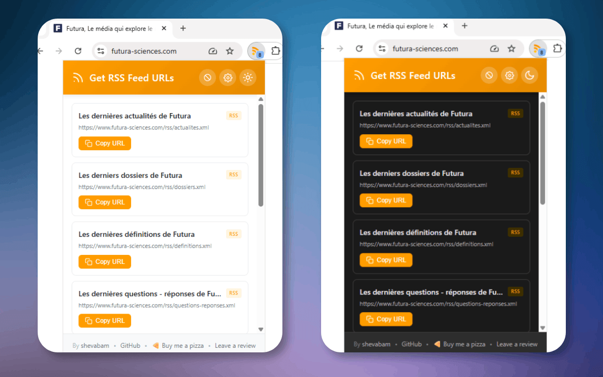
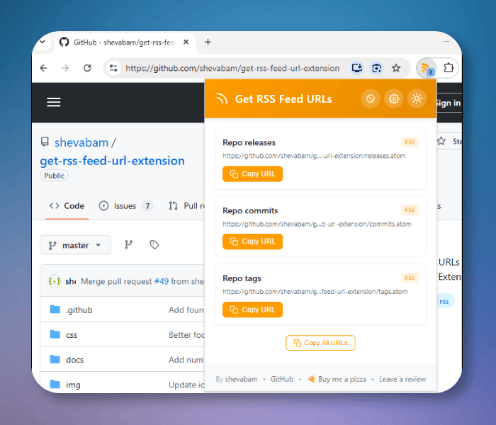
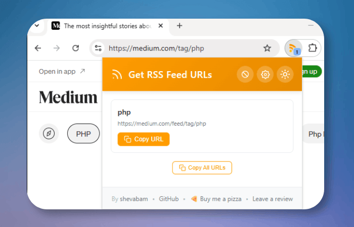
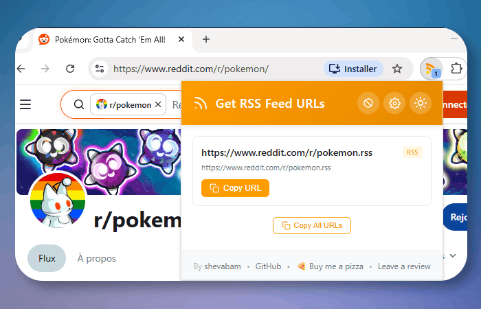
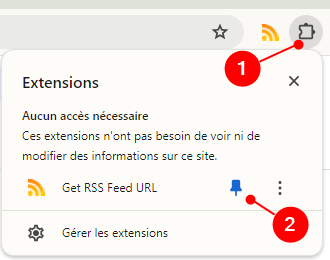
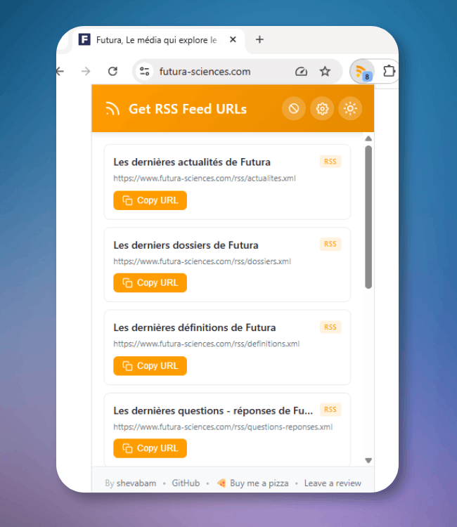

# What is Get RSS Feed URL Extension?

**Get RSS Feed URL is a Google Chrome extension that provides links to the various RSS/Atom feeds of a website.**

Indeed, websites do not always provide a direct link to the RSS feed. It is then necessary to look in the source code of the website and find the URL of the feed.

This extension makes it possible to avoid this manipulation because the URLs of the RSS feeds of the website are displayed directly and can be copied with one click!

In addition, this extension allows you to easily retrieve the RSS feed from several sites that do not offer one natively:

* **Youtube:** RSS feeds for channel, user and playlist can be retrieve with this extension
* **Reddit:** the extension can retrieve RSS feeds from your Reddit homepage but also from a Reddit sub, a profile or post comments
* **Kickstarter:** the RSS feed of a Kickstarter project is retrieved
* **Vimeo:** RSS feed from a Vimeo channel
* **Github:** the extension retrieves RSS feeds from a Github repository *(releases, commits, tags)* and from a Github user *(activity)*
* **Gitlab:** same as Github
* **Medium:** retrieves the RSS feed of a page with a keyword (tag)
* **Itch.io:** get RSS feeds from Itch.io categories
* **Mirror.xyz:** retrieves the RSS feed of an user of Mirror.xyz

  
*Github repository*

  
*Medium tag page*

  
*Subreddit*

# Install

Install this extension from [**Chrome Web Store**](https://chrome.google.com/webstore/detail/get-rss-feed-url/kfghpdldaipanmkhfpdcjglncmilendn) or [**Microsoft Edge Store**](https://microsoftedge.microsoft.com/addons/detail/get-rss-feed-url/pgbelohmepchkohpdldadopkblkgbjom).

# Usage

After installing the extension, display it in your browser:

Then go to a site and click on the extension button to display the different RSS feeds found:

You can also open this popup from the keyboard shortcut: `Alt+Shift+R`. You can [edit it in your Chrome settings](chrome://extensions/shortcuts) (Extensions > Keyboard shortcuts).

You can copy the URL of an RSS feed by clicking on the "Copy URL" button.
If you want to copy the URLs of all RSS feeds found, click "Copy all URLs".

# Feedback

If you encounter a problem using Get RSS Feed URL extension, or would like to request an enhancement, feel free to create an issue or say hello on [Twitter/X](https://twitter.com/shevabam)!

# Privacy Policy

This extension does not collect, transmit, or sell any user data — nothing ever leaves your browser to the developer or to any third party.

To find RSS feeds, the extension automatically fetches the HTML of the pages you visit and, when needed, tests a fixed list of common feed paths (e.g. `/feed`, `/rss.xml`) on the site you're on. These requests go directly from your browser to that site — never through a server we control.

The extension stores the following locally on your device, and syncs it through your own Chrome account if Chrome Sync is enabled:

* a per-site cache of feed-detection results (kept 24 hours when feeds are found, 7 days otherwise), used to avoid re-scanning pages you've already visited;
* your preferences: light/dark theme, whether the feed-count badge is shown, and the list of sites you've chosen to ignore.

None of this is ever sent anywhere outside your own browser / Chrome account.

---

# Qu'est-ce que Get RSS Feed URL Extension ?

**Get RSS Feed URL est une extension Google Chrome qui permet d'obtenir les liens vers les différents flux RSS/Atom d'un site Internet.**

En effet, les sites Internet ne mettent pas toujours à disposition un lien direct vers le flux RSS. Il faut alors chercher dans le code source et trouver l'URL du flux.

Cette extension permet d'éviter cette manipulation car les URL des flux RSS du site Internet sont affichés directement et peuvent être copiés d'un simple clic !

De plus, cette extension vous permet de récupérer facilement le flux RSS de plusieurs sites qui n'en proposent pas nativement :

* **Youtube :** les flux RSS d'une chaîne, d'un utilisateur et d'une playlist peuvent être récupérés avec cette extension
* **Reddit :** l'extension arrive à récupérer les flux RSS de votre homepage Reddit mais aussi d'un sub Reddit, d'un profil ou des commentaires d'un post
* **Kickstarter :** le flux RSS d'un projet Kickstarter est récupéré
* **Vimeo :** flux RSS d'une chaîne Vimeo
* **Github :** l'extension récupère les flux RSS d'un dépôt Github *(releases, commits, tags)* et d'un utilisateur Github *(activité)*
* **Gitlab :** idem que Github
* **Medium :** récupère le flux RSS d'une page d'un mot-clé (tag)
* **Itch.io :** retourne les flux RSS des catégories Itch.io
* **Mirror.xyz :** récupère le flux RSS d'un utilisateur Mirror.xyz

  
*Github repository*

  
*Medium tag page*

  
*Subreddit*

# Installation

Installez l'extension à partir du [**Chrome Web Store**](https://chrome.google.com/webstore/detail/get-rss-feed-url/kfghpdldaipanmkhfpdcjglncmilendn?hl=fr) ou sur [**Microsoft Edge Store**](https://microsoftedge.microsoft.com/addons/detail/get-rss-feed-url/pgbelohmepchkohpdldadopkblkgbjom).

# Utilisation

Après avoir installé l'extension, affichez-la dans votre barre :

Rendez-vous ensuite sur un site et cliquez sur le bouton de l'extension pour afficher les différents flux RSS trouvés :

Vous pouvez aussi ouvrir cette popup à partir du raccourci clavier : `Alt+Shift+R`. Vous pouvez le [modifier dans vos paramètres Chrome](chrome://extensions/shortcuts) (Extensions > Raccourcis clavier).

Vous pouvez copier l'URL d'un flux RSS en cliquant sur le bouton "Copy URL".  
Si vous souhaitez copier les URL de tous les flux RSS trouvés, cliquez sur "Copy all URLs".

# Feedback

Si vous rencontrez un problème avec l'extension Get RSS Feed URL, ou que vous souhaitez une évolution, n'hésitez pas à créer une *issue* ou à me contacter sur [Twitter/X](https://twitter.com/shevabam) !

# Politique de confidentialité

Cette extension ne collecte, ne transmet et ne vend aucune donnée utilisateur — rien ne quitte jamais votre navigateur vers le développeur ou vers un tiers.

Pour trouver les flux RSS, l'extension récupère automatiquement le code HTML des pages que vous visitez et, si nécessaire, teste une liste fixe de chemins de flux courants (ex. `/feed`, `/rss.xml`) sur le site consulté. Ces requêtes partent directement de votre navigateur vers ce site — jamais via un serveur que nous contrôlons.

L'extension stocke localement sur votre appareil les éléments suivants, synchronisés via votre propre compte Chrome si la synchronisation Chrome est activée :

* un cache par site des résultats de détection de flux (conservé 24 heures si des flux sont trouvés, 7 jours sinon), utilisé pour éviter de rescanner les pages déjà visitées ;
* vos préférences : thème clair/sombre, affichage ou non du badge de comptage de flux, et la liste des sites que vous avez choisi d'ignorer.

Rien de tout cela n'est jamais envoyé en dehors de votre navigateur ou de votre compte Chrome.

